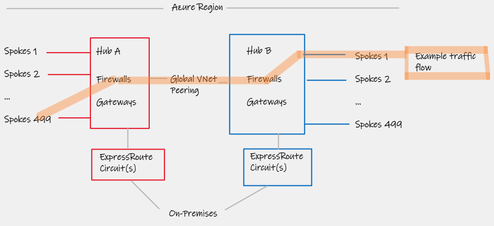
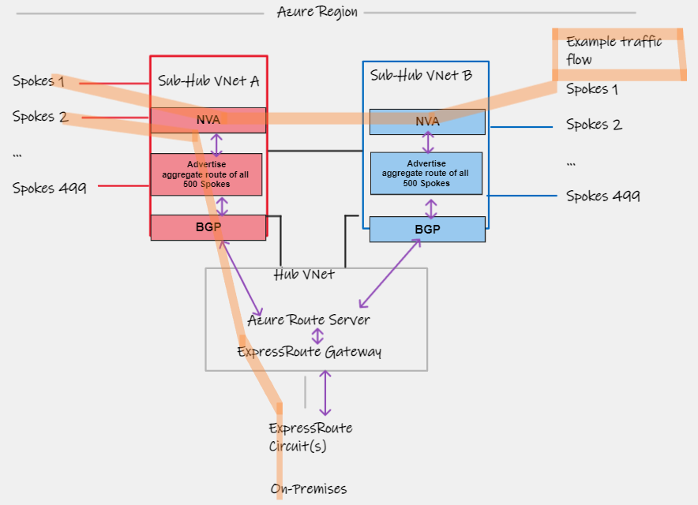
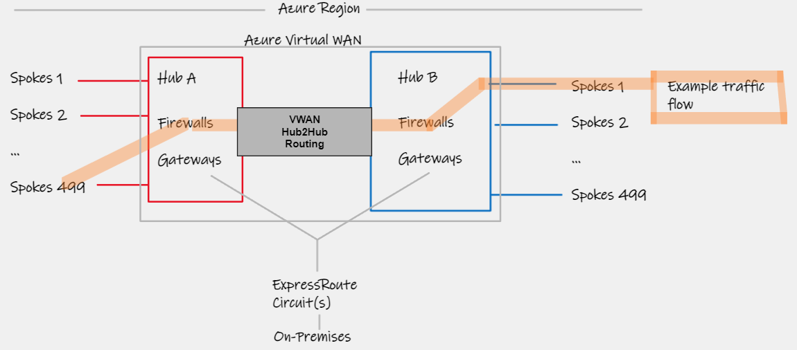
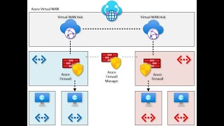
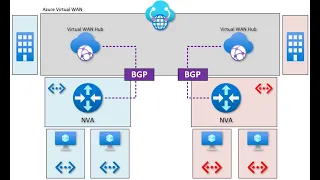

# Azure network patterns for beyond 500 Spokes Virtual Networks

## Introduction  

The use of Spoke Virtual networks in a star pattern (aka [hub/spoke](https://learn.microsoft.com/en-us/azure/architecture/reference-architectures/hybrid-networking/hub-spoke?tabs=cli)) has long being the defacto design for most customers on Azure. In fact, for a long period of time, this was a USP for the Azure SDN. With its ability to leverage common centralised services (E.g. Firewalls, Network Gateways, Domain Controllers) it represents a simple, easy-to-understand and operate mode, that was also cost efficient.

With the advent of Azure Virtual WAN, we also saw the introduction of a Microsoft managed central hub, which offered an alternative networking pattern for customers building out their regional VNet designs, but this fundamentally is still anchored to the idea of a [hub/spoke topology](https://learn.microsoft.com/en-us/azure/architecture/networking/hub-spoke-vwan-architecture), wherein the underlying Virtual WAN VNet connections are making use of the same technologies in the Azure SDN as VNet peering does, to a traditional hub. 

To help customers choose between the former, customer-managed hub/spoke, and latter, VWAN-based, guidance has developed such as choosing a network topology within the framework of [Azure Landing Zones](https://learn.microsoft.com/en-us/azure/cloud-adoption-framework/ready/azure-best-practices/define-an-azure-network-topology). 

## Subscription Democratization

This reference to Azure Landing Zones (ALZ) and the Cloud Adoption Framework allows us to segway nicely in to the concept of [Subscription Democratization](https://learn.microsoft.com/en-us/azure/cloud-adoption-framework/ready/landing-zone/design-principles#subscription-democratization), which ultimately advocates for more subscriptions, rather than less. (Best click the link to understand the Why behind this statement).

Let us also now state another fundamental behaviour of the Azure SDN/VNet model today, that is, today, a Virtual Network must be contained with a single subscription. 

Put these two vectors togethers (subscription democratization, and VNet's being bound to a subscriptions) and the natural result is a proliferation in the quantity of Virtual Networks (VNets) that a customer has to wrangle with.

## Azure SDN Limits

To tee up our topology options section, we need to call-out some platform limits in Azure today. Specifically a maximum of [500 Virtual Network Peerings per VNet](https://learn.microsoft.com/en-us/azure/azure-resource-manager/management/azure-subscription-service-limits#:~:text=Virtual%20network%20peerings%20per%20virtual%20network). (This means you cannot go beyond 500 Spokes VNets hanging off a single Hub VNet, whether that be customer-managed, or Azure Virtual WAN).

The next limit we need to be aware of, is that you can only specify [400 user-defined routes per UDR route table](User-defined routes per route table). Therefore if you are forcing traffic via a Virtual Appliance (Azure Firewall or NVA etc) within your Hub environment, this effectively reduces the number of Spokes you can support down to 400. (Every Spoke will have a minimum of one [VNet address space](https://learn.microsoft.com/en-us/azure/virtual-network/virtual-networks-udr-overview#:~:text=hop%20types%20follow%3A-,Virtual%20network,-%3A%20Routes%20traffic%20between), which will need to be reflected in a unique UDR line entry).

## The Challenge

Therefore some customers, particular larger Enterprise customers who have 1000's of Applications hosted on Azure, may well arrive at the junction between the above two sections, and ask the question: _"So what does an Azure Networking design look like, to support beyond 500 (400) Spoke VNets?"_

We will lay out the options within two categories, those based on Customer-Managed Hub/Spokes designs, and those based on Azure Virtual WAN

## [1] Customer-managed hub/spoke based designs

### [1a] Multiple Hubs

Generally when we deploy "Another hub", it normally represents another Azure region, but it is perfectly possible to deploy multiple hub VNets in the same region to scale out in units of 500 spokes. The main considerations with this approach are:

- Each Hub requires it's own set of Network Services (Virtual Network Gateways, Firewalls, etc)
- Ensuring optimal Spoke-Hub-Hub-Spoke routing. Just as with normal multi-region bow-tie ExpressRoute designs, you need to [ensure traffic between Hub's uses Global VNet Peering](https://learn.microsoft.com/en-us/azure/expressroute/virtual-network-connectivity-guidance). Therefore you are going to require separate ExpressRoute Circuits to ensure routes do not leak between hubs via an ExpressRoute Circuit. (You cannot use UDR to over-ride if you have more than 400 VNets remember.). 
- Additional costs of multiple VNet peering hops (and the cost impact of the aforementioned additional network components)
- Overall UDR complexity, remember VNet peering is not transitive, therefore your an AZFW/NVA is doing the IP forwarding between VNets that are not directly peered

### [1b] Tiered VNets with Azure Route Server

If you wish to continue leveraging a single central hub for some shared services, including Virtual Network Gateways (E.g. ExpressRoute Gateway) then it is possible to combine Network Virtual Appliances with Azure Route Server, to build a "tiered VNet" design wherein the NVA appliances advertise summary/aggregate routes that represent the 2nd tier of indirect spokes.

Considerations/notes:
- NVA must be BGP aware (no AZFW)
- HA complexity
- ARS Routing prefix limits
- Same double-hop VNet Peering charges

## [2] Azure Virtual WAN based designs

### [2a] Multiple Hubs

Virtual WAN makes it easy to deploy multiple hubs, and this now includes support for multiple hubs in the same Azure Region. We have some of the same considerations as [1a] such as cost and duplication of components, but the UDR complexity is greatly simplified.

We can also make use of common ExpressRoute circuits without hitting UDR limits with Global VNet Peering, as Azure Virtual WAN [Routing Preference](https://learn.microsoft.com/en-us/azure/virtual-wan/about-virtual-hub-routing-preference) takes care of the spoke-hub-hub-spoke routing for us. 

Please note [Routing Intent Policies](https://learn.microsoft.com/en-us/azure/virtual-wan/how-to-routing-policies) are required to enable the flow shown below using Firewalls within the Virtual WAN Hub. This feature is in preview today. Today, this design also will only work with Azure Firewall, as no other E/W Firewalls are currently available as NVA-in-hub partners. (Some are on the way, E.g. Fortinet). (See NVA-in-hub official docs).

### [2b] Tiered VNets with Virtual WAN static routes

This pattern, often referred to as the "tiered vnet" design, or using "indirect spokes" if somewhat common now, and allows the use of Azure Firwall in the Hub-VNet that hangs off Virtual WAN. The UDR complexity is relatively low, and you continue to benefit from using Azure Virtual WAN for Global Routing.

Remember static routes, today, are locally signifcant in Virtual WAN so you will need a static route on every hub, for every Hub VNet that is connected, regardless of its region.

- Daniel Mauser's lab  guide: https://github.com/dmauser/azure-virtualwan/tree/main/inter-region-nva

- Official MS doc: https://docs.microsoft.com/en-us/azure/virtual-wan/scenario-route-through-nva

- Video tutorial: https://youtu.be/YZ0EQDut6_8

### [2b] Tiered VNets with Virtual WAN BGP Peering

Same as [2a] but uses BGP between NVA (so no AZFW) and Azure VWAN Hub, removes need to static route config, also gives dynamic routing which is beneficial if you happent to not be using contiguous address spaces in the indirect spokes.

- Daniel Mauser's lab  guide: https://github.com/dmauser/azure-virtualwan/tree/main/inter-region-nvabgp

- Official MS doc: https://docs.microsoft.com/en-us/azure/virtual-wan/scenario-bgp-peering-hub

- Video tutorial: https://youtu.be/wZ3DBO7hmoI

-
